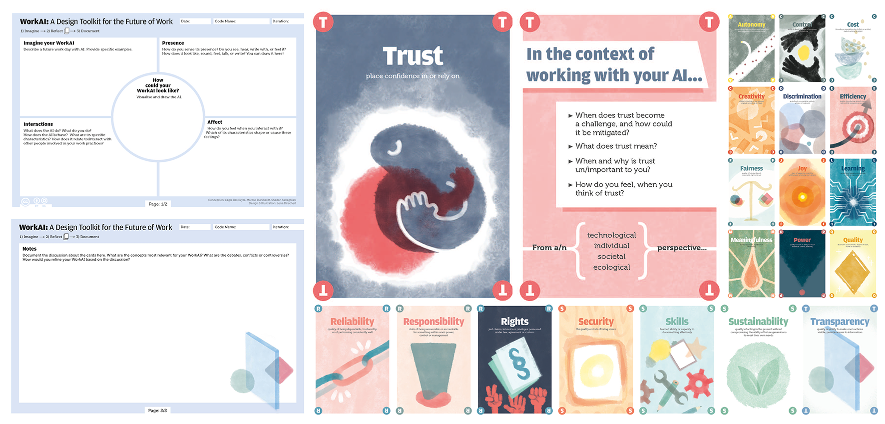
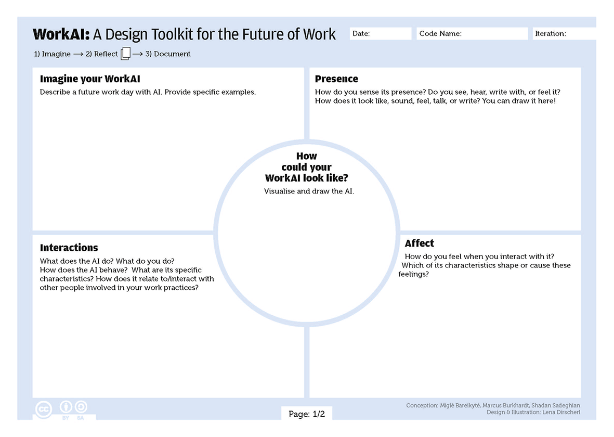
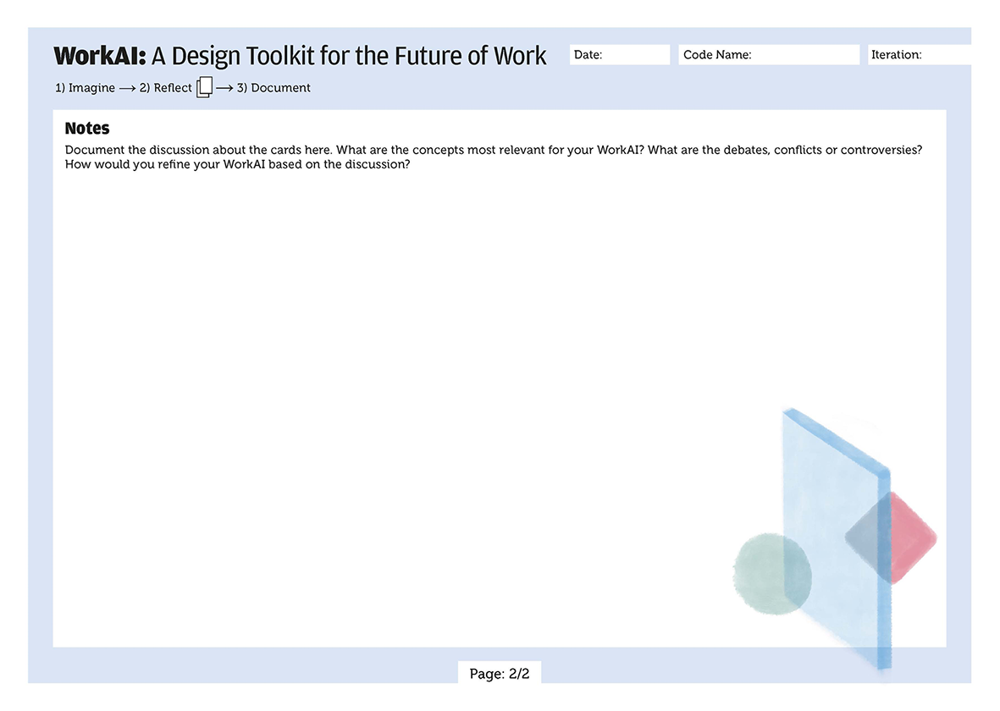

# Work AI: A Toolkit for the Design of AI-driven Future of Work

This repository contains the files of the WorkAI Toolkit, which consists of a deck of 20 cards and a canvas. The deck of 20 cards is in DIN A5 format (148x210mm), and each card has two sides filled with content. The canvas is set up in DIN A3 (420x297mm) and has 2 sides; the front side is dedicated to the first stage of the design process (imagine), while the back side is intended for documentation and notes.

## Printing the Toolkit

The easiest way to print the WorkAI Toolkit is using the print-at-home version of the card deck, which is set up in DIN A4 (297 x 210mm) format. Each sheet contains 2 cards. Make sure to print the file two-sided in landscape format. After printing, cut each page in half, and you have a full set of 20 cards. We recommend using at least 200g/m2 paper for printing the cards.

The canvas should be printed on DIN A3 (297 × 420mm) or similar-sized paper. Each workshop group needs at least one canvas. 

Alternatively, you can also send the cards and the canvas to a print service. The quality of the PDF files is high enough.

## How to Use the WorkAI Toolkit

The toolkit is designed and can be used along a three-stage process: (1) Imagine → (2) Reflect → (3) Document

<table>
	<tr>
		<td>
			
		</td>
		<td>
			<b>(1) Imagine:</b> In the Imagine step, participants are asked to imagine a WorkAI: How does a typical work day look when working with AI? What does the AI look like and how do users experience it? What does the AI do? How do users interact with the AI? How do users feel about the AI and interacting with it? To document their vision, the participants are asked to use the first page of the canvas.
		</td>
	</tr>
	<tr>
		<td>
			
		</td>
		<td>
			<b>(2) Reflect:</b> In the Reflection phase, participants are asked to use the card deck to reflect on the impact and implications of the imagined WorkAI. Each card features a concept and a short description on the front, and a series of questions on the back. These questions are designed to stimulate discussion about the importance of the specific concept in shaping interactions with the WorkAI imagined in the first phase. Specifically, the Reflect phase addresses various perspectives on working with the imagined AI, including technological, individual, social and ecological. Participants are asked to review the cards, select and prioritize the concepts they consider most important and relevant to their imagined future work experiences with AI, and discuss the questions raised on the cards.
		</td>
	</tr>
	<tr>
		<td>
			
		</td>
		<td>
			<b>(3) Document:</b> The third phase is to document the outcomes of the co-design process and discussion on the second page of the canvas: Which concepts proved most relevant to your WorkAI? Which concept spurred the most controversy? How would you refine your WorkAI based on the discussion?
		</td>
	</tr>
</table>

## Credits

The WorkAI Toolkit was conceptualized by Miglė Bareikytė, Marcus Burkhardt, and Shadan Sadeghian. The cards and the canvas was designed and illustrated by Lena Dirscherl.

## License and Citation

The WorkAI Toolkit is released under the Creative Commons License [CC-BY-SA-4.0](https://creativecommons.org/licenses/by-sa/4.0/).

Please cite the following article:
https://doi.org/10.1145/3757525
